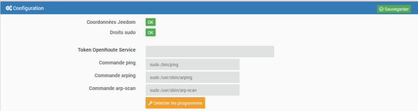
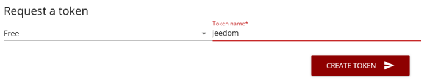
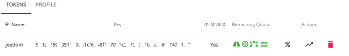
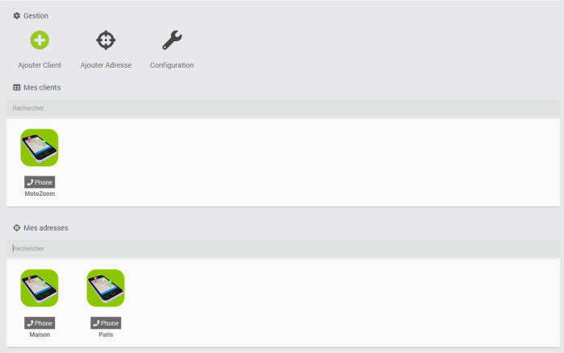
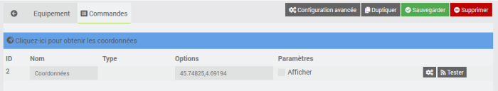

Infos & Localisation
=============

Description
-----------
Plugin permettant de connaitre la localisation d'un téléphone et d'autres informations.

Il se décompose en deux parties, la présence sur le réseau (ping icmp, ping arp, arp-scan) et les informations du téléphone (batterie, localisation, etc..) grâce à l'utilisation d'une application tierce installée sur le téléphone (Macrodroid, Tasker, Automate,...).

Installation 
============

#### 1. Installation
- Télécharger le plugin
- Activer le plugin

#### 2. Dépendances
> **Important**
>
> Il est très vivement recommandé de lancer l’installation des dépendances (même si elles apparaissent OK). Puis à la fin de rafraichir la page.

Configuration 
============

#### 1. OpenRoute Service

En cliquant sur "Token OpenRoute Service" vous serez redirigés sur la page d'inscription au service.
Ce service est totalement gratuit dans la limite de 2000 requêtes par jour.

Une fois connecté, vous devez demander un token gratuit

La création du token est immédiate. Vous pouvez le copier dans votre "Dashboard" sur le site d'OpenRoute Service

#### 2. Méthodes de détection de présence

Lors de l'installation des dépendances, tous les programmes utiles sont normalement installés.
Cliquez sur le bouton "Détecter les programmes" afin que le plugin détecte le dossier d'installation et que Jeedom peut bien appeler ces programmes.

Le plugin
=========

Rendez vous dans le menu Plugins &gt; Objets connectés pour retrouver le plugin.

Sur la partie haute de cette page, vous avez plusieurs boutons.
- Ajouter client : Un appareil mobile.
- Ajouter adresse : Les coordonnées d'un point fixe utilisés par les clients.
- Bouton Configuration : Ouvre la fenêtre de configuration du plugin.

#### 1. Ajout d'un client

Comme partout dans Jeedom vous pouvez ici :

- Donner un nom.
- Choisir son objet parent.
- L’activer/le rendre visible ou non.

##### Commandes

#### 2. Ajout d'adresse

Comme partout dans Jeedom vous pouvez ici :

- Donner un nom.
- Choisir son objet parent.
- L’activer/le rendre visible ou non.

> **A Noter**
>
> Quand vous créer une adresse, elle est initialisée avec les coordonnées renseignées dans la configuration de Jeedom. Si elles sont vides, le plugin en met par défaut.

##### Commandes

Une adresse n'as qu'une commande qui contient les coordonnées.
Il y à un lien vers un site permettant de récupérer les coordonnées selon une adresse.
Elle doivent être au format Latitude,Longitude
